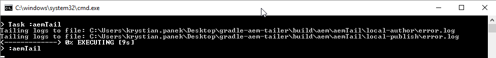

# Gradle AEM Tailer

  

## Description

Tailer is tool based on Gradle AEM Plugin task named `instanceTail`. See [documentation](../../README.md#task-instanceTail).

## Usage

1. Download archive [gradle-aem-tailer.zip](https://github.com/Cognifide/gradle-aem-plugin/raw/master/dists/gradle-aem-tailer.zip)
2. Extract archive on any file system location.
3. Start tool:
    * Windows - script: *gradlew.bat* (by double clicking)
    * Unix - script: *gradlew*
4. Use *Ctrl + C* to stop tool.

## Configuration

1. Stop tool if running.
2. Edit *gradle.properties* file.
3. Start tool again.

## Tips

* After updating file *incidentFilter.txt* tool does not need to be restarted.
* By clicking on incident GUI notification, file with corresponding logs will be opened. On Windows, consider setting nicer than *Notepad* default text editor for *.log files (e.g [Notepad++](https://notepad-plus-plus.org)) to use it immediatelly after clicking on notification.